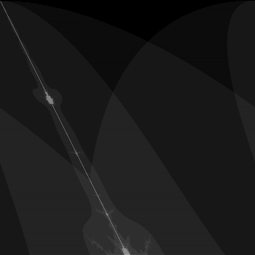
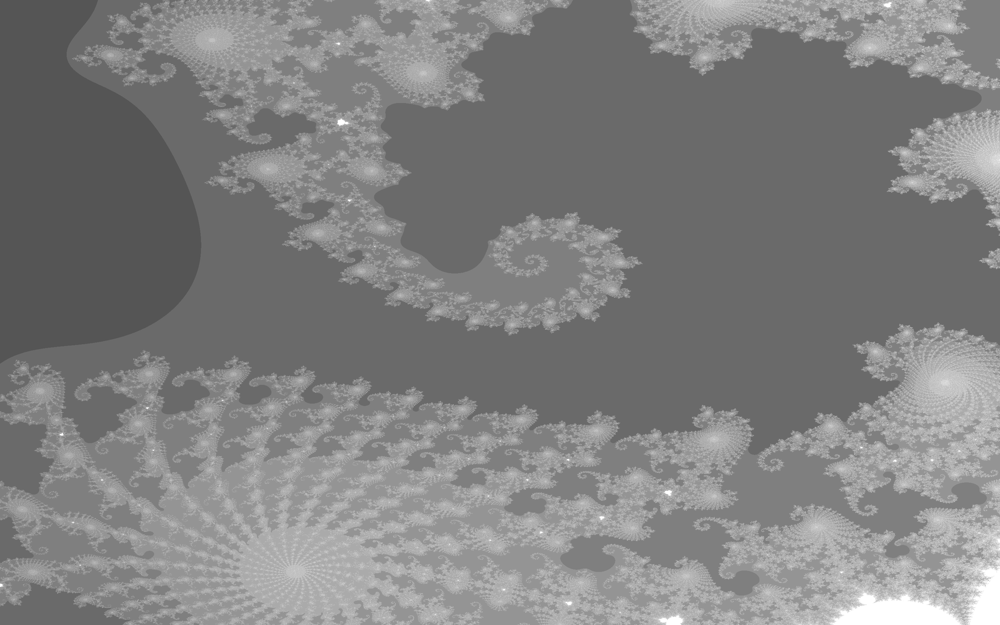
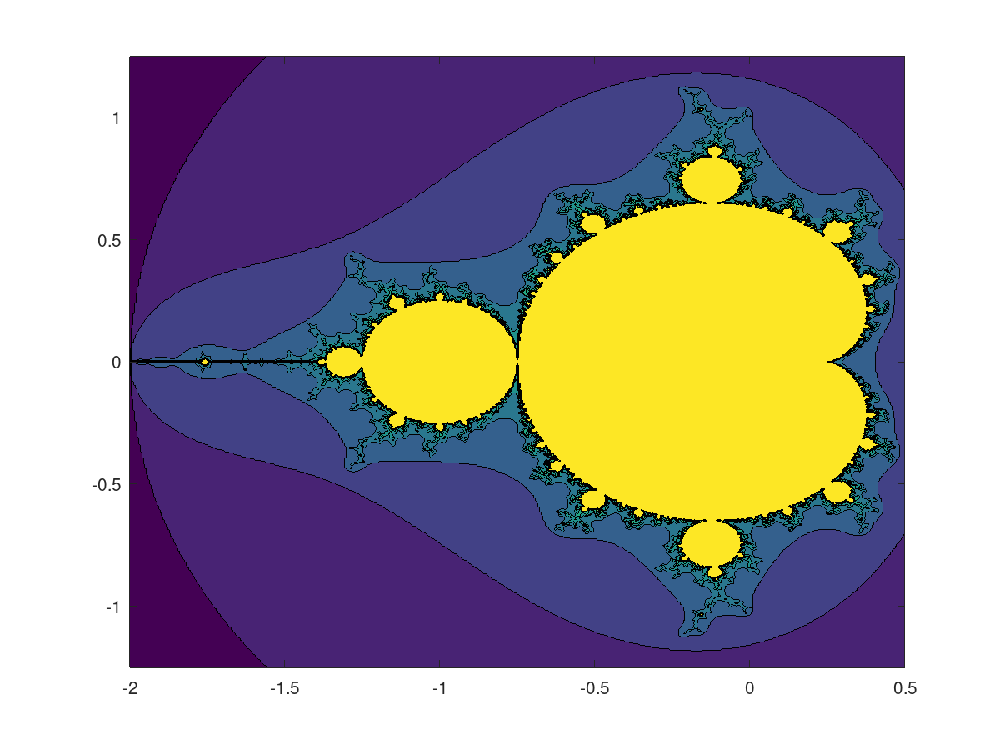
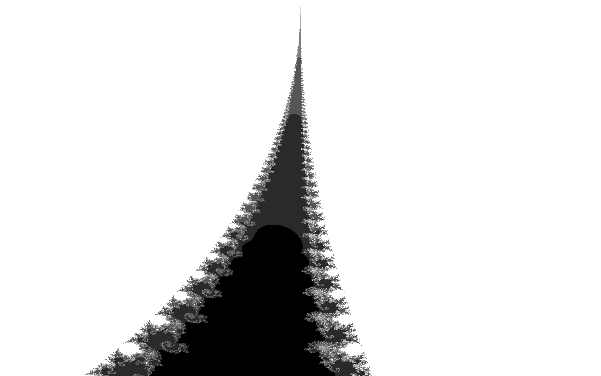
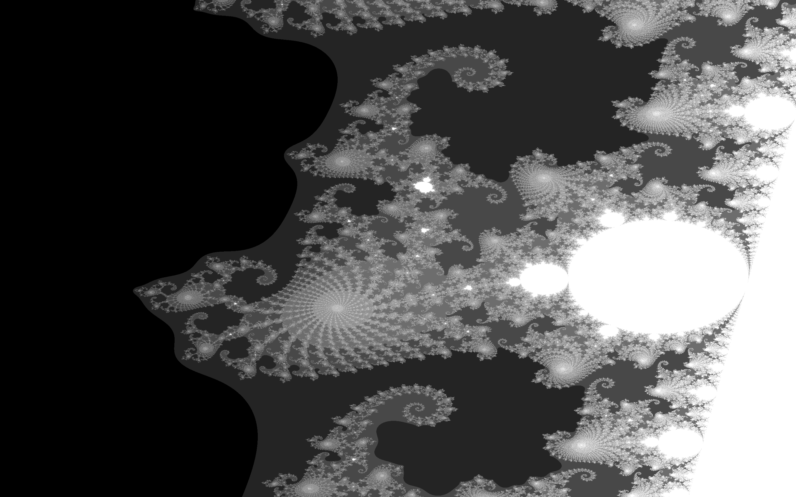
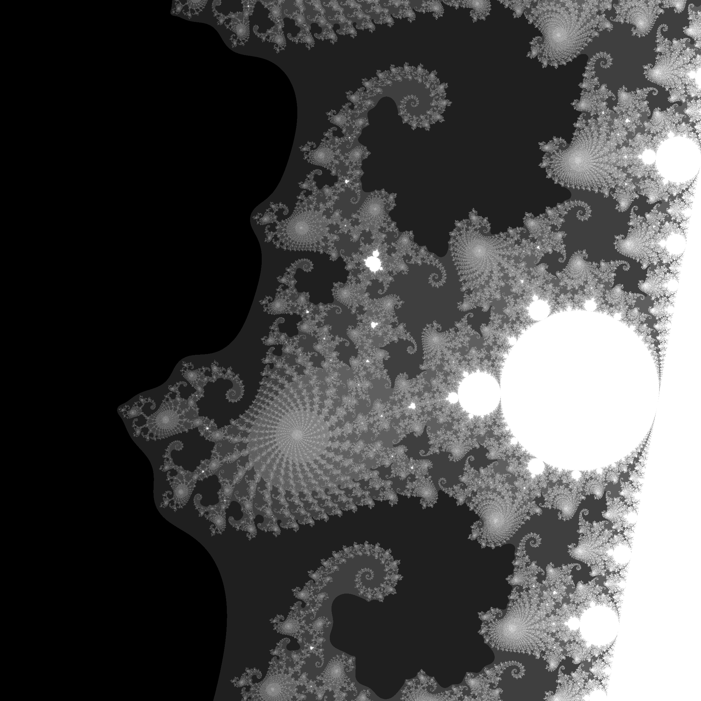
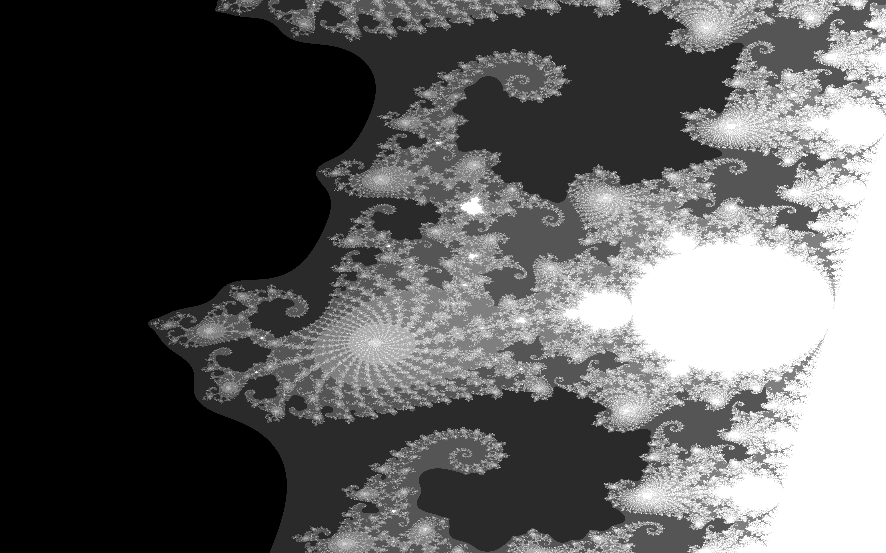
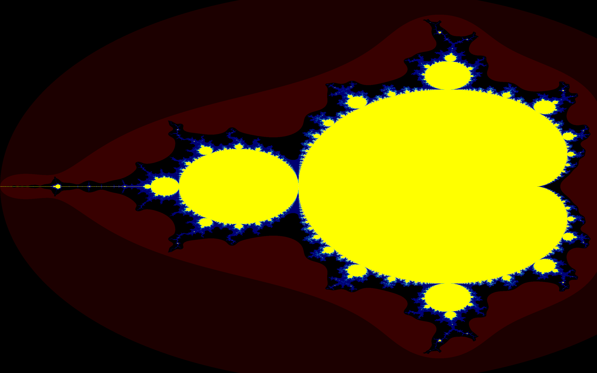
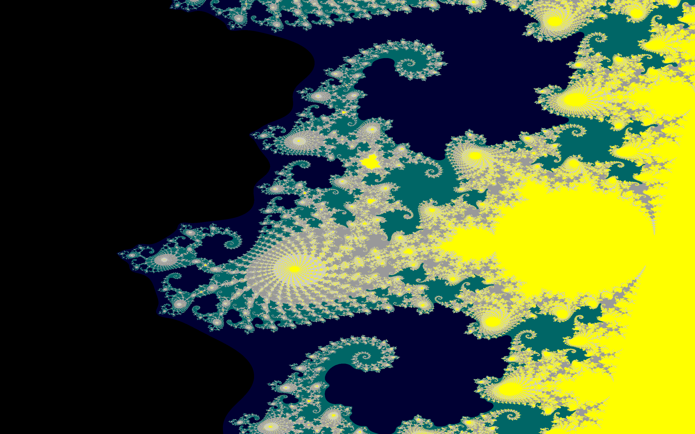

# Images
## Naming Format
The Names of the MSet images are in the format 
>`Image Name (optional)`,`Program Name`,`Location X (optional)`,`Location Y (optional)`,`Scale (optional)`
## Special images
### `MSetBroken,MSet.f90.png`
This image was created while there was a bug in the code

### `Fun,MSet.f90.png`
This image was created before contrast was improved by moving (if all the values were >0) down to a new 0

## `MSet.m` Images
### `MSet.m,-0.75,0,1.6.png`

## `MSet.f90` Images
### `MSet Matrix,MSet.f90,0,0,1.png`

### `MSet Matrix 2,MSet.f90.png`

### `MSet.f90,-0.75,0.08,25.png`

### `MSet.f90,-0.74548,0.11669,313.png`

### `Icon,MSet.f90,-0.74548,0.11669,313.png`

### `HD,MSet.f90,-0.74548,0.11669,313.png`

### `MSet8001x8001,MSet.f90,0,0,1.png`

## `MSet2Color.f90` Images
### `ColorTest,MSet2Color.f90,-0.75,0,1.6.png`

### `ColorVersion,MSet2Color.f90,-0.74548,0.11669,313.png`

